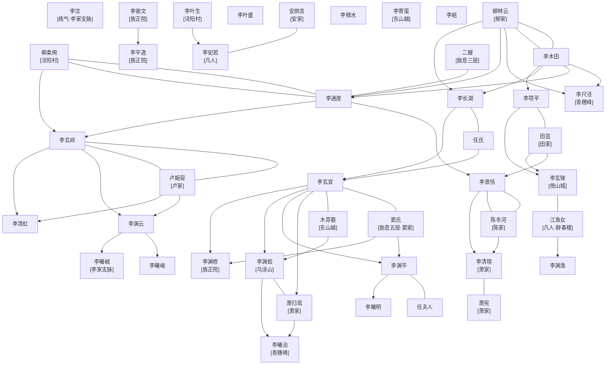

# 李氏族谱

```mermaid
graph TD
  p1["李汶<br/>[练气·李家支脉]"]
  p2["木芽鹿<br/>[东山越]"]
  p3["李清虹"]
  p4["李项平"]
  p5["李清晓<br/>[萧家]"]
  p6["李玄岭"]
  p7["李渊渔"]
  p8["李曦明"]
  p9["陈冬河<br/>[陈家]"]
  p10["田芸<br/>[田家]"]
  p11["江渔女<br/>[凡人·醉春楼]"]
  p12["柳柔绚<br/>[泾阳村]"]
  p13["卢婉容<br/>[卢家]"]
  p14["柳林云<br/>[柳家]"]
  p15["李长湖"]
  p16["李叶生<br/>[泾阳村]"]
  p17["李渊修<br/>[族正院]"]
  p18["窦氏<br/>[胎息五层·窦家]"]
  p19["李叶盛"]
  p20["李曦峻"]
  p21["李曦峸<br/>[李家支脉]"]
  p22["任夫人"]
  p23["李木田"]
  p24["任氏"]
  p25["李平逸<br/>[族正院]"]
  p26["李渊蛟<br/>[乌涂山]"]
  p27["李渊云"]
  p28["李谢文<br/>[族正院]"]
  p29["萧归鸾<br/>[萧家]"]
  p30["李根水"]
  p31["李妃若<br/>[凡人]"]
  p32["李渊平"]
  p33["李寄蛮<br/>[东山越]"]
  p34["李景恬"]
  p35["李曦治<br/>[青穗峰]"]
  p36["二嫂<br/>[胎息三层]"]
  p37["李通崖"]
  p38["李尺泾<br/>[青穗峰]"]
  p39["李岨"]
  p40["李玄锋<br/>[倚山城]"]
  p41["李玄宣"]
  p42["安鹧言<br/>[安家]"]
  p43["萧宪<br/>[萧家]"]
  p23 --> p4
  p23 --> p15
  p14 --> p15
  p23 --> p37
  p14 --> p37
  p23 --> p38
  p14 --> p38
  p4 --> p40
  p10 --> p40
  p15 --> p41
  p24 --> p41
  p37 --> p6
  p12 --> p6
  p10 --> p34
  p37 --> p34
  p41 --> p17
  p18 --> p17
  p41 --> p26
  p2 --> p26
  p28 --> p25
  p11 --> p7
  p6 --> p3
  p13 --> p3
  p6 --> p27
  p13 --> p27
  p16 --> p31
  p41 --> p32
  p18 --> p32
  p34 --> p5
  p9 --> p5
  p26 --> p35
  p29 --> p35
  p32 --> p8
  p27 --> p21
  p27 --> p20
  p41 --> p29
  p23 --- p14
  p15 --- p24
  p4 --- p10
  p14 --- p23
  p37 --- p12
  p12 --- p37
  p36 --- p37
  p9 --- p34
  p41 --- p2
  p40 --- p11
  p6 --- p13
  p34 --- p9
  p13 --- p6
  p41 --- p18
  p26 --- p29
  p42 --- p31
  p5 --- p43
  p32 --- p22
  classDef foreign stroke-dasharray: 5 5;
```
