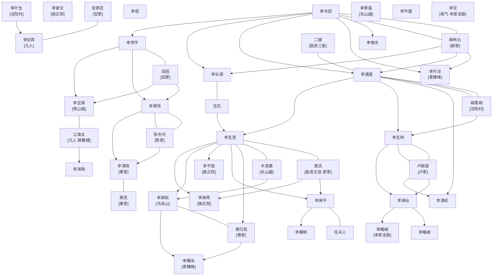

# 李氏族谱

```mermaid
graph TD
  p1["李清虹"]
  p2["李根水"]
  p3["李清晓<br/>[萧家]"]
  p4["李项平"]
  p5["李叶生<br/>[泾阳村]"]
  p6["李玄宣"]
  p7["李谢文<br/>[族正院]"]
  p8["木芽鹿<br/>[东山越]"]
  p9["李曦治<br/>[青穗峰]"]
  p10["李木田"]
  p11["李岨"]
  p12["李渊蛟<br/>[乌涂山]"]
  p13["任夫人"]
  p14["李渊渔"]
  p15["李曦峸<br/>[李家支脉]"]
  p16["田芸<br/>[田家]"]
  p17["李通崖"]
  p18["安鹧言<br/>[安家]"]
  p19["卢婉容<br/>[卢家]"]
  p20["李妃若<br/>[凡人]"]
  p21["李曦明"]
  p22["李玄岭"]
  p23["李渊云"]
  p24["萧宪<br/>[萧家]"]
  p25["江渔女<br/>[凡人·醉春楼]"]
  p26["李渊修<br/>[族正院]"]
  p27["李渊平"]
  p28["李寄蛮<br/>[东山越]"]
  p29["窦氏<br/>[胎息五层·窦家]"]
  p30["柳林云<br/>[柳家]"]
  p31["柳柔绚<br/>[泾阳村]"]
  p32["陈冬河<br/>[陈家]"]
  p33["李长湖"]
  p34["李曦峻"]
  p35["李叶盛"]
  p36["李玄锋<br/>[倚山城]"]
  p37["李景恬"]
  p38["二嫂<br/>[胎息三层]"]
  p39["李尺泾<br/>[青穗峰]"]
  p40["李汶<br/>[练气·李家支脉]"]
  p41["任氏"]
  p42["萧归鸾<br/>[萧家]"]
  p43["李平逸<br/>[族正院]"]
  p10 --> p4
  p10 --> p33
  p30 --> p33
  p10 --> p17
  p30 --> p17
  p10 --> p39
  p30 --> p39
  p17 --> p6
  p41 --> p6
  p4 --> p36
  p16 --> p36
  p17 --> p22
  p31 --> p22
  p10 --> p2
  p4 --> p37
  p16 --> p37
  p6 --> p26
  p29 --> p26
  p6 --> p12
  p8 --> p12
  p6 --> p43
  p25 --> p14
  p17 --> p1
  p19 --> p1
  p22 --> p23
  p19 --> p23
  p5 --> p20
  p6 --> p27
  p29 --> p27
  p37 --> p3
  p32 --> p3
  p12 --> p9
  p42 --> p9
  p27 --> p21
  p23 --> p15
  p23 --> p34
  p6 --> p42
  p10 --- p30
  p33 --- p41
  p4 --- p16
  p30 --- p10
  p17 --- p31
  p31 --- p17
  p38 --- p17
  p32 --- p37
  p6 --- p8
  p36 --- p25
  p22 --- p19
  p37 --- p32
  p19 --- p22
  p6 --- p29
  p12 --- p42
  p18 --- p20
  p3 --- p24
  p27 --- p13
  classDef foreign stroke-dasharray: 5 5;
```
