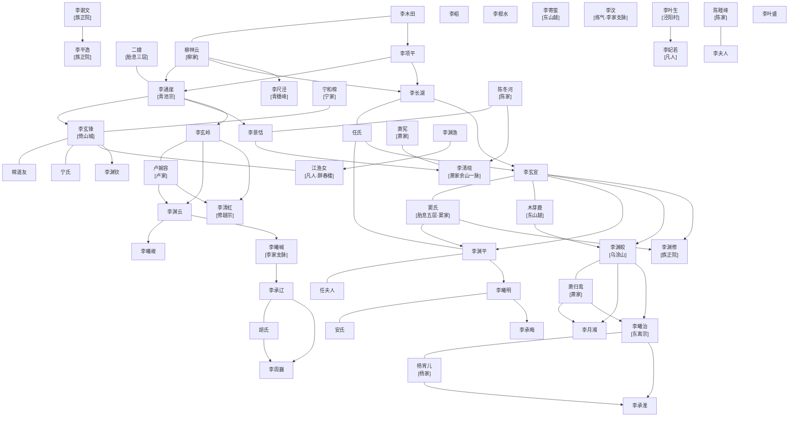

# 李氏族谱

```mermaid
graph TD
  p1["李木田"]
  p2["江渔女<br/>[凡人·醉春楼]"]
  p3["木芽鹿<br/>[东山越]"]
  p4["李叶生<br/>[泾阳村]"]
  p5["李曦治<br/>[东离宗]"]
  p6["李月湘"]
  p7["李岨"]
  p8["李根水"]
  p9["李渊钦"]
  p10["李长湖"]
  p11["卢婉容<br/>[卢家]"]
  p12["李承辽"]
  p13["李尺泾<br/>[青穗峰]"]
  p14["李曦明"]
  p15["李景恬"]
  p16["宁和棉<br/>[宁家]"]
  p17["李渊平"]
  p18["李寄蛮<br/>[东山越]"]
  p19["李平逸<br/>[族正院]"]
  p20["李通崖<br/>[青池宗]"]
  p21["李渊修<br/>[族正院]"]
  p22["李承淮"]
  p23["李汶<br/>[练气·李家支脉]"]
  p24["二嫂<br/>[胎息三层]"]
  p25["李玄岭"]
  p26["萧归鸾<br/>[萧家]"]
  p27["陈睦峰<br/>[陈家]"]
  p28["李清晓<br/>[萧家余山一脉]"]
  p29["李曦峻"]
  p30["窦氏<br/>[胎息五层·窦家]"]
  p31["李渊蛟<br/>[乌涂山]"]
  p32["陈冬河<br/>[陈家]"]
  p33["李周巍"]
  p34["柳林云<br/>[柳家]"]
  p35["李玄锋<br/>[倚山城]"]
  p36["任夫人"]
  p37["任氏"]
  p38["棉道友"]
  p39["宁氏"]
  p40["李玄宣"]
  p41["杨宵儿<br/>[杨家]"]
  p42["安氏"]
  p43["萧宪<br/>[萧家]"]
  p44["李曦峸<br/>[李家支脉]"]
  p45["李项平"]
  p46["李承晦"]
  p47["李谢文<br/>[族正院]"]
  p48["李清虹<br/>[修越宗]"]
  p49["李妃若<br/>[凡人]"]
  p50["胡氏"]
  p51["李渊渔"]
  p52["李渊云"]
  p53["李叶盛"]
  p54["李夫人"]
  p1 --> p45
  p10 --> p40
  p37 --> p40
  p34 --> p13
  p20 --> p25
  p45 --> p10
  p34 --> p10
  p20 --> p15
  p40 --> p21
  p30 --> p21
  p45 --> p20
  p34 --> p20
  p40 --> p31
  p3 --> p31
  p47 --> p19
  p25 --> p48
  p11 --> p48
  p25 --> p52
  p11 --> p52
  p4 --> p49
  p40 --> p17
  p30 --> p17
  p15 --> p28
  p32 --> p28
  p31 --> p5
  p26 --> p5
  p17 --> p14
  p52 --> p44
  p52 --> p29
  p51 --> p2
  p31 --> p6
  p26 --> p6
  p44 --> p12
  p5 --> p22
  p41 --> p22
  p35 --> p9
  p12 --> p33
  p50 --> p33
  p14 --> p46
  p20 --> p35
  p1 --- p34
  p10 --- p37
  p24 --- p20
  p32 --- p15
  p40 --- p3
  p35 --- p2
  p25 --- p11
  p40 --- p30
  p31 --- p26
  p43 --- p28
  p17 --- p36
  p5 --- p41
  p16 --- p35
  p35 --- p39
  p35 --- p38
  p37 --- p17
  p12 --- p50
  p27 --- p54
  p14 --- p42
  classDef foreign stroke-dasharray: 5 5;
```
