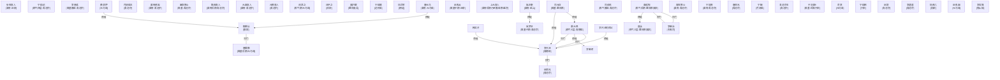

# 青池宗师徒

```mermaid
graph TD
  p1["萧元思<br/>[练气七层·青穗峰]"]
  p2["步梓真人<br/>[紫府·迟家]"]
  p3["宁和远<br/>[练气四层·青池宗]"]
  p4["韩文许"]
  p5["李恩成<br/>[筑基巅峰·青池宗]"]
  p6["唐摄都<br/>[筑基后期·元乌峰]"]
  p7["吠罗牙<br/>[筑基中期·青池宗]"]
  p8["唐元乌<br/>[紫府·元乌峰]"]
  p9["月湖峰主<br/>[青池宗]"]
  p10["紫府老祖<br/>[紫府·青池宗]"]
  p11["黑衣修士<br/>[筑基·青池宗]"]
  p12["隋观真人<br/>[紫府后期·青池宗]"]
  p13["元素真人<br/>[紫府·青池宗]"]
  p14["元修真人<br/>[青池宗]"]
  p15["邓求之<br/>[练气期·元乌峰]"]
  p16["邓予之<br/>[邓家]"]
  p17["袁护鳄<br/>[蕈林袁氏]"]
  p18["宁和靖<br/>[远刑峰]"]
  p19["郁慕仙<br/>[郁家]"]
  p20["杨将军<br/>[朝廷]"]
  p21["袁成照<br/>[练气后期·蕈林原袁家]"]
  p22["袁湍<br/>[练气三层·蕈林原袁家]"]
  p23["李曦明"]
  p24["迟炙云<br/>[筑基中期·迟家]"]
  p25["上元真人<br/>[紫府后期乃至巅峰·修越宗]"]
  p26["费清伊<br/>[元乌峰]"]
  p27["端木奎<br/>[紫府·巫山]"]
  p28["司伯休<br/>[练气巅峰·青池宗]"]
  p29["迟师兄<br/>[青池宗]"]
  p30["李尺泾的师父"]
  p31["司元白<br/>[筑基·蕈林原]"]
  p32["青衣修士<br/>[紫府·青池宗]"]
  p33["宁迢宵<br/>[紫府·青池宗]"]
  p34["唐师兄<br/>[青池宗]"]
  p35["李尺泾<br/>[青穗峰]"]
  p36["宁婉<br/>[月湖峰]"]
  p37["青池宗主<br/>[青池宗]"]
  p38["李曦治<br/>[东离宗]"]
  p39["于羽楔†<br/>[筑基·岭海于家]"]
  p40["余肃<br/>[元乌峰]"]
  p41["宁和棉<br/>[宁家]"]
  p42["迟尉<br/>[青池宗]"]
  p43["李通崖<br/>[青池宗]"]
  p44["杨宵儿<br/>[杨家]"]
  p45["迟炙烟<br/>[元乌峰]"]
  p46["李玄锋<br/>[倚山城]"]
  p31 -->|师徒| p35
  p1 ---|同门| p35
  p35 ---|同门| p1
  p30 -->|师徒| p35:::foreign
  p4 -->|师徒| p35:::foreign
  p31 -->|师徒| p1
  p35 ---|同门| p29
  p27 -->|师徒| p7:::foreign
  p26 -->|师徒| p19:::foreign
  p1 -->|师徒| p23:::foreign
  p19 ---|同门| p6
  p8 -->|师徒| p19
  p21 -->|师徒| p22
  p21 ---|同门| p38
  p38 ---|同门| p21
  classDef foreign stroke-dasharray: 5 5;
```
