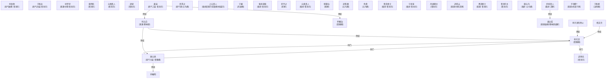

# 青池宗师徒

```mermaid
graph TD
  p1["司伯休<br/>[练气巅峰·青池宗]"]
  p2["宁和远<br/>[练气四层·青池宗]"]
  p3["李曦明"]
  p4["韩文许"]
  p5["李曦治<br/>[青穗峰]"]
  p6["吠罗牙<br/>[筑基中期·青池宗]"]
  p7["萧元思<br/>[练气七层·青穗峰]"]
  p8["唐师兄<br/>[青池宗]"]
  p9["元修真人<br/>[青池宗]"]
  p10["袁立成<br/>[筑基巅峰·蕈林原袁家]"]
  p11["迟尉<br/>[青池宗]"]
  p12["步梓真人<br/>[紫府·迟家]"]
  p13["邓求之<br/>[练气期·元乌峰]"]
  p14["上元真人<br/>[紫府后期乃至巅峰·修越宗]"]
  p15["宁婉<br/>[月湖峰]"]
  p16["紫府老祖<br/>[紫府·青池宗]"]
  p17["邓予之<br/>[邓家]"]
  p18["元素真人<br/>[紫府·青池宗]"]
  p19["郁慕仙<br/>[郁家]"]
  p20["迟炙烟<br/>[元乌峰]"]
  p21["余肃<br/>[元乌峰]"]
  p22["李尺泾<br/>[青穗峰]"]
  p23["青衣修士<br/>[紫府·青池宗]"]
  p24["司元白<br/>[筑基·蕈林原]"]
  p25["李尺泾的师父"]
  p26["宁迢宵<br/>[紫府·青池宗]"]
  p27["迟师兄<br/>[青池宗]"]
  p28["月湖峰主<br/>[青池宗]"]
  p29["迟炙云<br/>[筑基中期·迟家]"]
  p30["黑衣修士<br/>[筑基·青池宗]"]
  p31["青池宗主<br/>[青池宗]"]
  p32["唐元乌<br/>[紫府·元乌峰]"]
  p33["袁湍<br/>[练气三层·青池宗]"]
  p34["于羽楔†<br/>[筑基·岭海于家]"]
  p35["宁和靖<br/>[远刑峰]"]
  p24 -->|师徒| p22
  p7 ---|同门| p22
  p22 ---|同门| p7
  p25 -->|师徒| p22:::foreign
  p4 -->|师徒| p22:::foreign
  p33 -->|师徒| p24
  p24 -->|师徒| p7
  p22 ---|同门| p27
  p12 -->|师徒| p10:::foreign
  p7 -->|师徒| p3:::foreign
  p33 -->|师徒| p5
  classDef foreign stroke-dasharray: 5 5;
```
