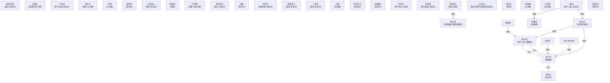

# 青池宗师徒

```mermaid
graph TD
  p1["紫府老祖<br/>[紫府·青池宗]"]
  p2["迟炙云<br/>[筑基中期·迟家]"]
  p3["宁和远<br/>[练气四层·青池宗]"]
  p4["唐元乌<br/>[紫府·元乌峰]"]
  p5["余肃<br/>[元乌峰]"]
  p6["唐师兄<br/>[青池宗]"]
  p7["元素真人<br/>[紫府·青池宗]"]
  p8["萧元思<br/>[练气七层·青穗峰]"]
  p9["郁慕仙<br/>[郁家]"]
  p10["于羽楔†<br/>[筑基·岭海于家]"]
  p11["韩文许"]
  p12["李尺泾<br/>[青穗峰]"]
  p13["青衣修士<br/>[紫府·青池宗]"]
  p14["迟尉<br/>[青池宗]"]
  p15["吠罗牙<br/>[筑基中期·青池宗]"]
  p16["李尺泾的师父"]
  p17["黑衣修士<br/>[筑基·青池宗]"]
  p18["宁迢宵<br/>[紫府·青池宗]"]
  p19["宁婉<br/>[月湖峰]"]
  p20["青池宗主<br/>[青池宗]"]
  p21["袁立成<br/>[筑基巅峰·蕈林原袁家]"]
  p22["月湖峰主<br/>[青池宗]"]
  p23["迟师兄<br/>[青池宗]"]
  p24["邓求之<br/>[练气期·元乌峰]"]
  p25["司伯休<br/>[练气巅峰·青池宗]"]
  p26["步梓真人<br/>[紫府·迟家]"]
  p27["上元真人<br/>[紫府后期乃至巅峰·修越宗]"]
  p28["邓予之<br/>[邓家]"]
  p29["迟炙烟<br/>[元乌峰]"]
  p30["宁和靖<br/>[远刑峰]"]
  p31["袁湍<br/>[练气三层·青池宗]"]
  p32["李曦明"]
  p33["元修真人<br/>[青池宗]"]
  p34["司元白<br/>[筑基·蕈林原]"]
  p35["李曦治<br/>[青穗峰]"]
  p34 -->|师徒| p12
  p8 ---|同门| p12
  p12 ---|同门| p8
  p16 -->|师徒| p12:::foreign
  p11 -->|师徒| p12:::foreign
  p31 -->|师徒| p34
  p34 -->|师徒| p8
  p12 ---|同门| p23
  p26 -->|师徒| p21:::foreign
  p32 -->|师徒| p8:::foreign
  p31 -->|师徒| p35
  classDef foreign stroke-dasharray: 5 5;
```
